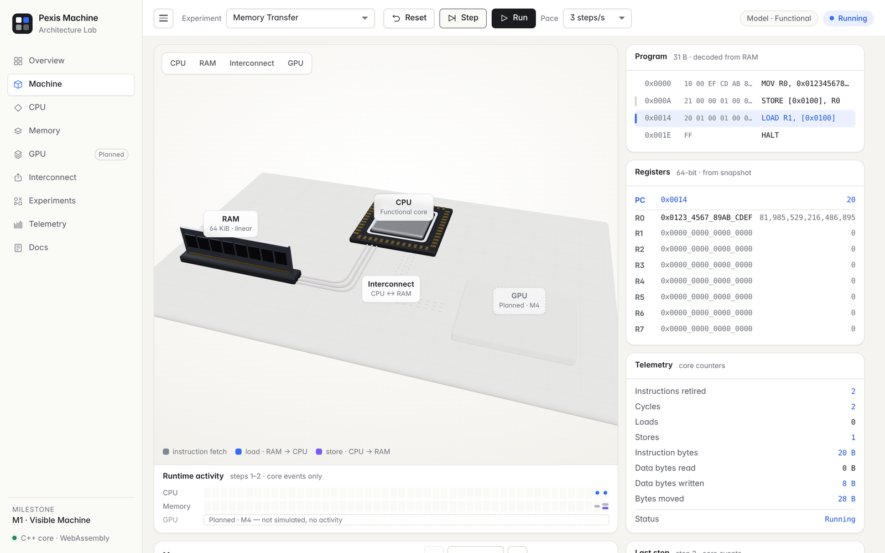

# Pexis Machine

**Experimental computer architecture laboratory.**

Pexis Machine is a platform for designing, simulating, measuring, and visualizing complete computer systems in software.

The project begins with a small deterministic CPU and memory system. It is designed to evolve, only when experiments justify it, toward caches, memory controllers, interconnects, GPUs, accelerators, heterogeneous systems, and experimental computer architectures.

> **Simulation is truth. Visualization is observation.**

## M0 · Machine Alive

The first milestone establishes the simulation contract:

- C++20 simulation core;
- eight 64-bit general-purpose registers;
- byte-addressable linear RAM;
- a minimal ISA (`NOP`, `MOV_IMM64`, `LOAD64`, `STORE64`, `ADD`, `HALT`);
- deterministic fetch → decode → execute;
- fail-closed fault handling;
- first-class telemetry for instructions, memory operations, and bytes moved;
- immutable machine snapshots ready for a future WebAssembly boundary;
- GCC, Clang, ASan, and UBSan CI coverage.

## M1 · Visible Machine

The machine becomes visible in the browser — without a second implementation of it:

```text
C++ core = truth  →  WebAssembly = bridge  →  Web Lab = observer / controller
```

- architectural **machine events** (fetch, memory read/write, register write, retire, halt, fault) emitted by the core;
- a narrow, versioned **WebAssembly adapter** over the same `Machine` (Embind, BigInt for 64-bit values);
- a fail-closed TypeScript boundary that validates every value before rendering;
- an interactive **3D Web Lab** (Vite, React, Three.js): Step / Run / Pause / Reset, program view decoded from RAM,
  registers, paged memory viewer, telemetry, runtime activity, and RAM ↔ CPU transfers animated only from real events;
- experiments defined once in C++: Scalar Compute, Memory Transfer, Bounds Fault. GPU appears only as *Planned · M4*.



## Build

### Native (core, tests, demo)

Requirements: CMake 3.20+, a C++20 compiler.

```bash
cmake -S . -B build -DCMAKE_BUILD_TYPE=Release
cmake --build build --parallel
ctest --test-dir build --output-on-failure
./build/pxm-demo            # expected: R0 = 42
```

### Web Lab

Requirements: Node 20.19+ and [Emscripten](https://emscripten.org/docs/getting_started/downloads.html) 4.0.23.

The browser needs the WebAssembly module, which is generated (not committed). This is a separate, explicit step:

```bash
source /path/to/emsdk/emsdk_env.sh   # once per shell
cd web
npm ci
npm run wasm:build                   # C++ core -> web/src/wasm/pexis-machine.{js,wasm}
npm run dev                          # http://localhost:5173
```

Tests and production build:

```bash
npm test                             # unit + integration tests against the real WASM module
npm run build                        # typecheck + bundle in web/dist
ctest --test-dir ../build-wasm --output-on-failure   # core tests compiled to WebAssembly
```

Re-run `npm run wasm:build` after changing any C++ file. See [`docs/web-lab.md`](docs/web-lab.md) and
[`docs/wasm-boundary.md`](docs/wasm-boundary.md).

## Repository map

```text
include/pexis/machine/  public simulation contracts
src/                    simulation implementation
apps/pxm/               minimal executable demo
tests/                  deterministic core tests
wasm/                   WebAssembly adapter (bridge only)
scripts/                build-wasm.sh
web/                    Web Lab: Vite + React + Three.js
docs/                   vision, architecture, WASM boundary, Web Lab
```

## Roadmap

1. **M0 · Machine Alive**: functional CPU, RAM, ISA, faults, telemetry.
2. **M1 · Visible Machine**: WebAssembly adapter, machine events, interactive 3D Web Lab.
3. **M2 · Memory Hierarchy**: cache and memory-controller experiments.
4. **M3 · Timing**: pipeline and cycle-aware models.
5. **M4 · Heterogeneous Machine**: GPU/vector compute and shared interconnect.
6. **Future**: experimental architectures and possible FPGA implementations when evidence justifies them.

See [`docs/vision.md`](docs/vision.md) and [`docs/architecture.md`](docs/architecture.md) for the project contract.

## License

MIT.
